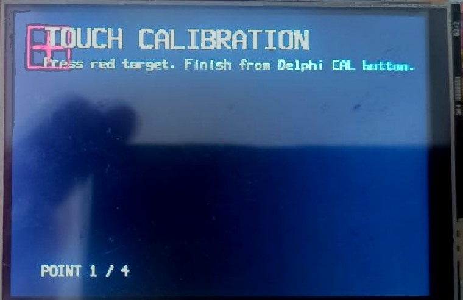
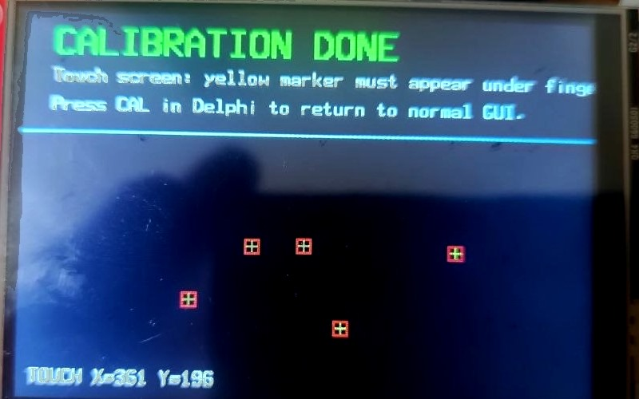

# STM32-CustomHID-Delphi7

USB Custom HID communication between STM32 BlackPill F401 and Delphi 7 using pure WinAPI.

No JVCL components.
No external HID libraries.
No virtual COM ports.

## Project Overview

The project demonstrates reliable bidirectional communication between:

* STM32F401CC BlackPill
* USB Custom HID
* Delphi 7 application
* Windows 11

The host application uses pure WinAPI HID functions and does not require any third-party Delphi components.

---

## Delphi Host Application

Features:

* Three numeric parameters
* Three switch controls
* Bidirectional synchronization
* TFT touch calibration button
* Automatic device reconnect
* Real-time HID packet monitoring

---

## Device GUI

Hardware:

* STM32F401CC BlackPill
* ILI9488 TFT Display
* XPT2046 Touch Controller

The embedded GUI contains:

* UP/DOWN controls
* Three software switches
* Touch calibration targets
* Status line
* HID communication layer

---

## TFT Touch Calibration

The Delphi application has a small `Cal` button. Pressing it sends a Custom HID
command to the STM32 and switches the TFT into touch calibration mode.

In calibration mode the display shows red targets one by one. Touch each target
as accurately as possible. The STM32 stores the raw XPT2046 touch values for the
four screen corners and calculates the runtime calibration coefficients.

After the fourth target the firmware automatically switches to the touch test
screen. Touch points are drawn as small markers so the result can be checked
immediately.

Press `Cal` in the Delphi application again to leave calibration/test mode and
return to the normal GUI. The current calibration is stored only in RAM, so it is
reset after MCU reboot.

---

## HID Packet Format

### STM32 → PC

| Byte | Description |
| ---- | ----------- |
| 0    | Command     |
| 1    | Value1      |
| 2    | Value2      |
| 3    | Value3      |
| 4    | SW1         |
| 5    | SW2         |
| 6    | SW3         |
| 7    | Checksum    |

### PC → STM32

| Byte | Description |
| ---- | ----------- |
| 0    | Command     |
| 1    | Value1      |
| 2    | Value2      |
| 3    | Value3      |
| 4    | SW1         |
| 5    | SW2         |
| 6    | SW3         |
| 7    | Checksum    |

PC commands:

* `0x02` - write GUI state
* `0x10` - start TFT touch calibration
* `0x11` - stop TFT touch calibration and return to normal GUI
* `0x12` - host keepalive ping

Calibration commands are carried inside the existing Custom HID packet. The
calculated touch calibration is runtime-only in this version and is reset after
MCU reboot. After the fourth calibration target, the TFT switches to a touch
test screen and draws a marker at each calibrated touch point. Press `Cal` in
the Delphi app again to return to the normal GUI.

---

## Repository Structure

### STM32

STM32CubeIDE project including:

* Core
* Drivers
* USB_DEVICE
* Middlewares
* .project
* .cproject
* .ioc

### Delphi7

Delphi 7 application:

* Project1.dpr
* Unit1.pas
* Unit1.dfm
* hid_raw.pas

---

## Tested Environment

* Windows 11
* Delphi 7
* STM32CubeIDE
* STM32F401CC BlackPill

---

## License

MIT License
