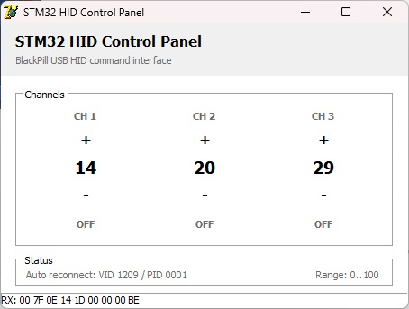
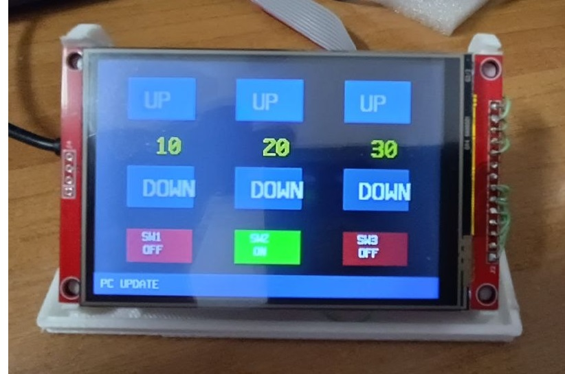

# STM32-CustomHID-Delphi7

USB Custom HID communication between STM32 BlackPill F401 and Delphi 7 using pure WinAPI.

No JVCL components.
No external HID libraries.
No virtual COM ports.

## Project Overview

The project demonstrates reliable bidirectional communication between:

* STM32F401CC BlackPill
* USB Custom HID
* Delphi 7 application
* Windows 11

The host application uses pure WinAPI HID functions and does not require any third-party Delphi components.

---

## Delphi Host Application

Features:

* Three numeric parameters
* Three switch controls
* Bidirectional synchronization
* Automatic device reconnect
* Real-time HID packet monitoring

---

## Device GUI

Hardware:

* STM32F401CC BlackPill
* ILI9488 TFT Display
* XPT2046 Touch Controller

The embedded GUI contains:

* UP/DOWN controls
* Three software switches
* Status line
* HID communication layer

---

## HID Packet Format

### STM32 → PC

| Byte | Description |
| ---- | ----------- |
| 0    | Command     |
| 1    | Value1      |
| 2    | Value2      |
| 3    | Value3      |
| 4    | SW1         |
| 5    | SW2         |
| 6    | SW3         |
| 7    | Checksum    |

### PC → STM32

| Byte | Description |
| ---- | ----------- |
| 0    | Command     |
| 1    | Value1      |
| 2    | Value2      |
| 3    | Value3      |
| 4    | SW1         |
| 5    | SW2         |
| 6    | SW3         |
| 7    | Checksum    |

---

## Repository Structure

### STM32

STM32CubeIDE project including:

* Core
* Drivers
* USB_DEVICE
* Middlewares
* .project
* .cproject
* .ioc

### Delphi7

Delphi 7 application:

* Project1.dpr
* Unit1.pas
* Unit1.dfm
* hid_raw.pas

---

## Tested Environment

* Windows 11
* Delphi 7
* STM32CubeIDE
* STM32F401CC BlackPill

---

## License

MIT License
